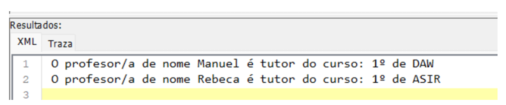

# Exercicio 2.2

## Apartado a)

XML de exemplo en [asignacions.xml](asignacions.xml)

XML Schema solución adxunta en [exercicio2_2a.xsd](exercicio2_2a.xsd)

## Apartado b)

Indique a expresión XPath que lle permita obter o número de sesións asignadas a un determinado 
profesor, coñecendo o seu cod_profesor. 

**Solución**

Supoñendo que queremos o número total de sesións asignadas ao profesor de código 11111111A:
```
sum(//profesor[@cod_profesor='11111111A']//num_sesiones)
```

## Apartado c)
Indique a expresión XQuery que lle permita obter un listado dos titores e o seu curso de titoría. A 
solución deberá ter o formato da seguinte imaxe:


**Solución**
```XQuery
for $x in //modulo[tutoria = "Sí"]
return <p> O profesor/a de nome {$x/ancestor::profesor/nombre/text()} é tutor do curso {$x/grupo/curso/text()} de {$x/grupo/ciclo/text()} </p>
```
